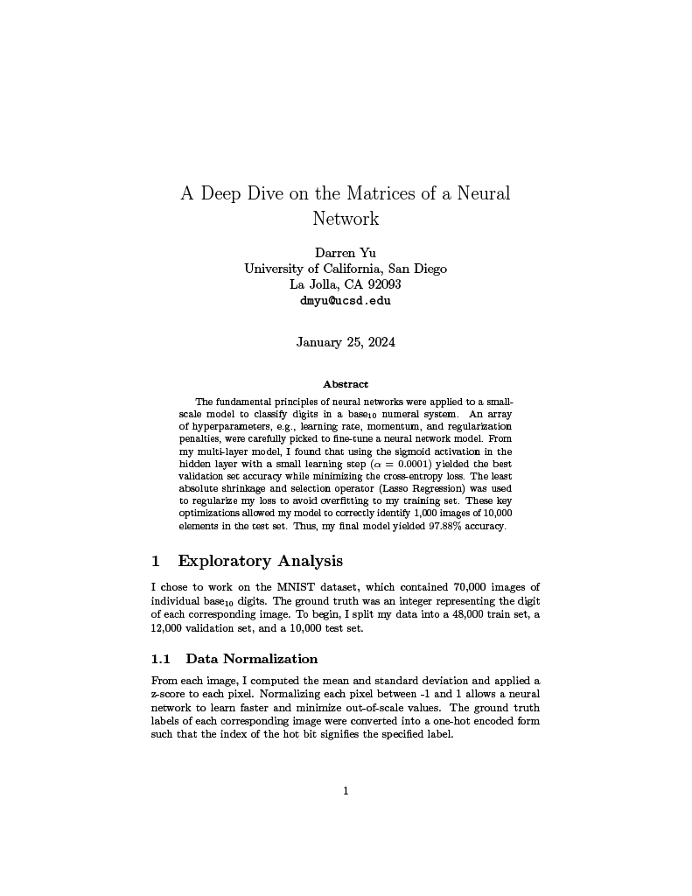
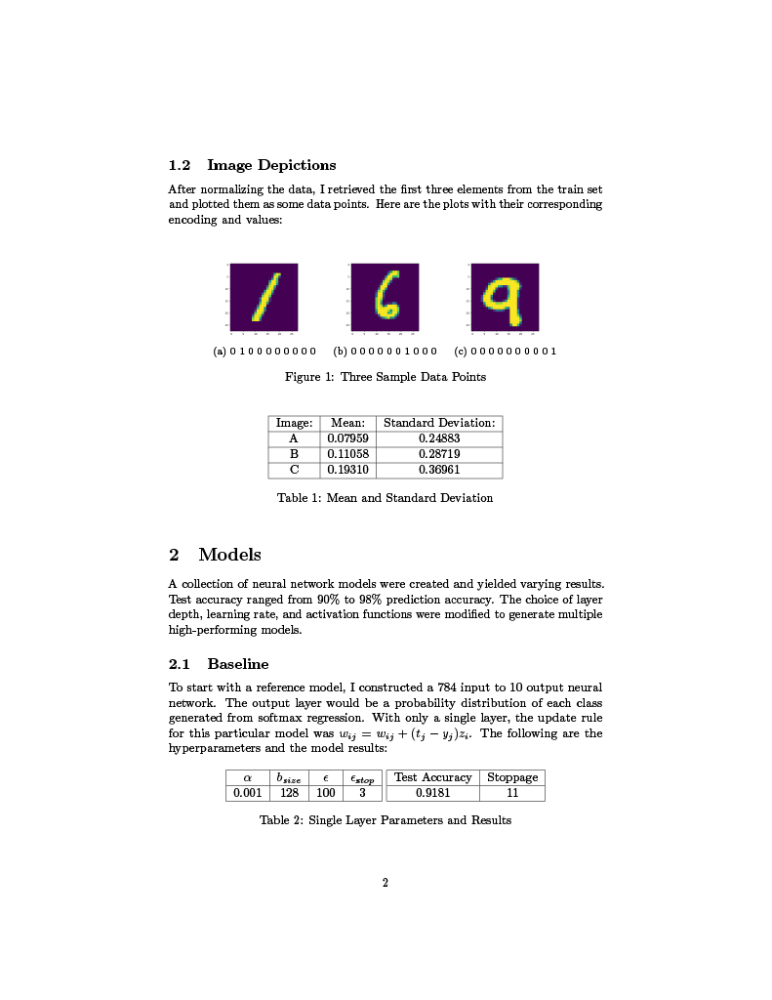
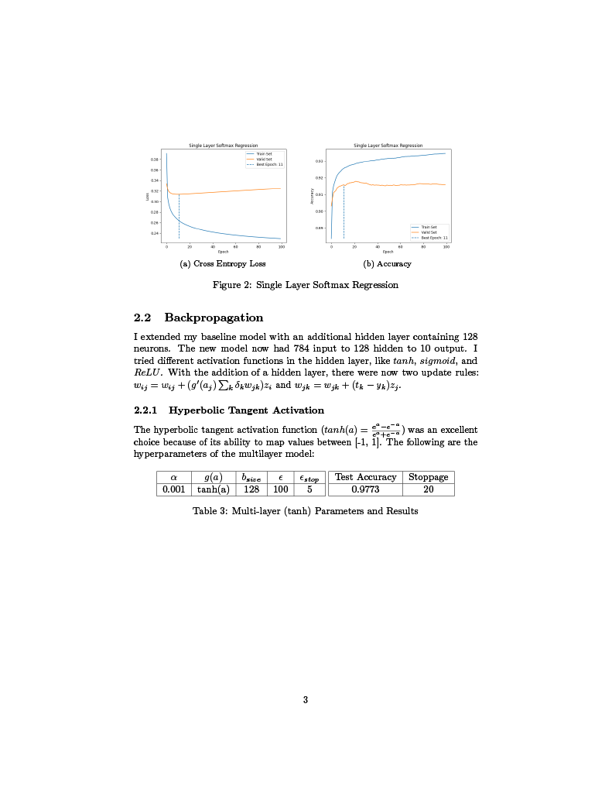
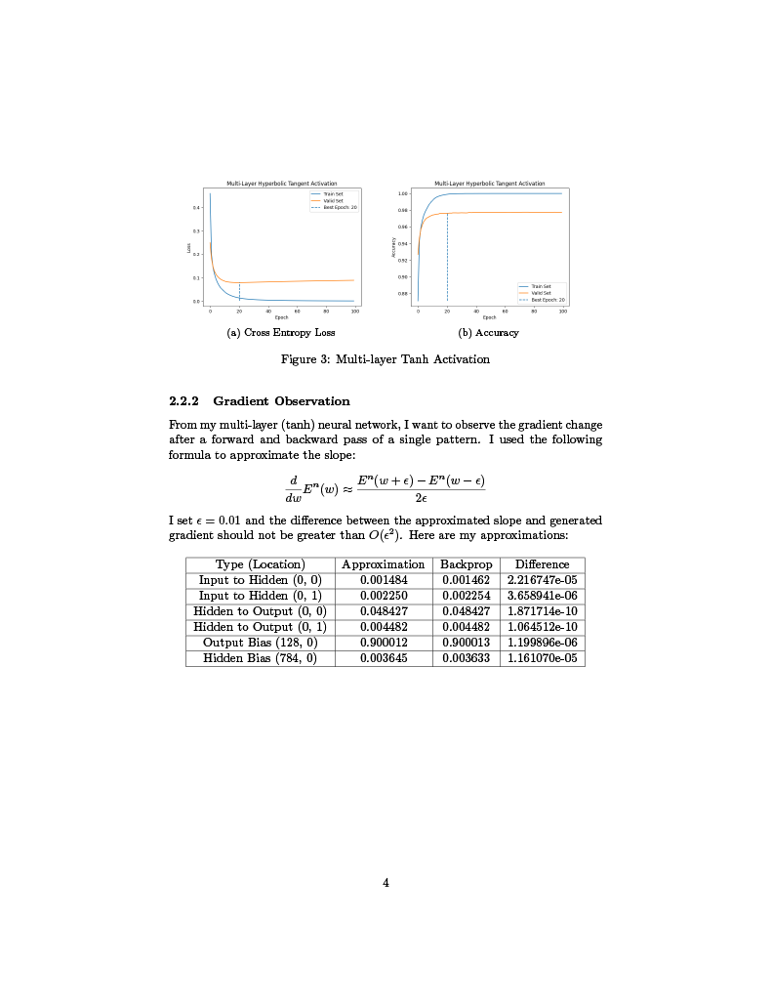
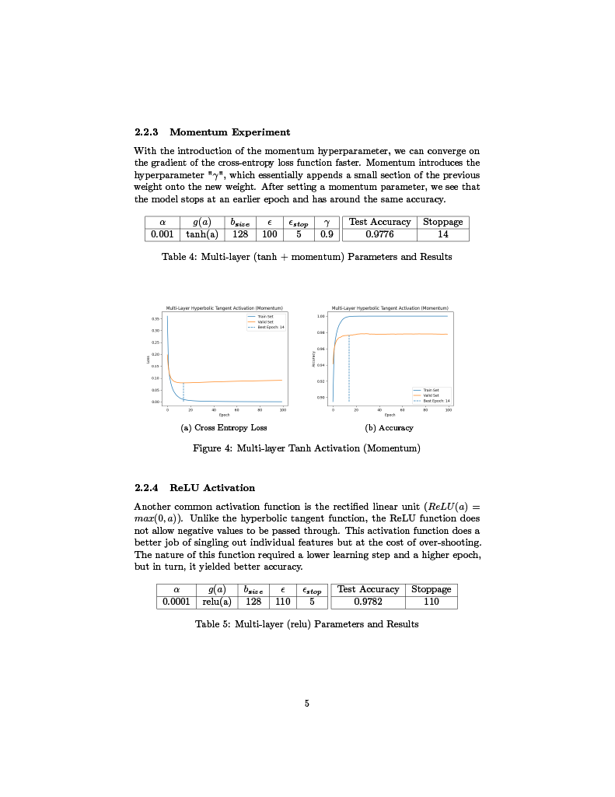
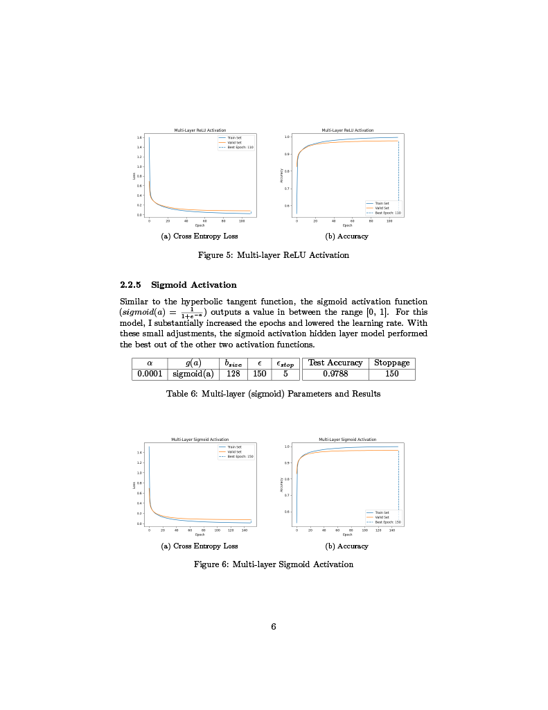
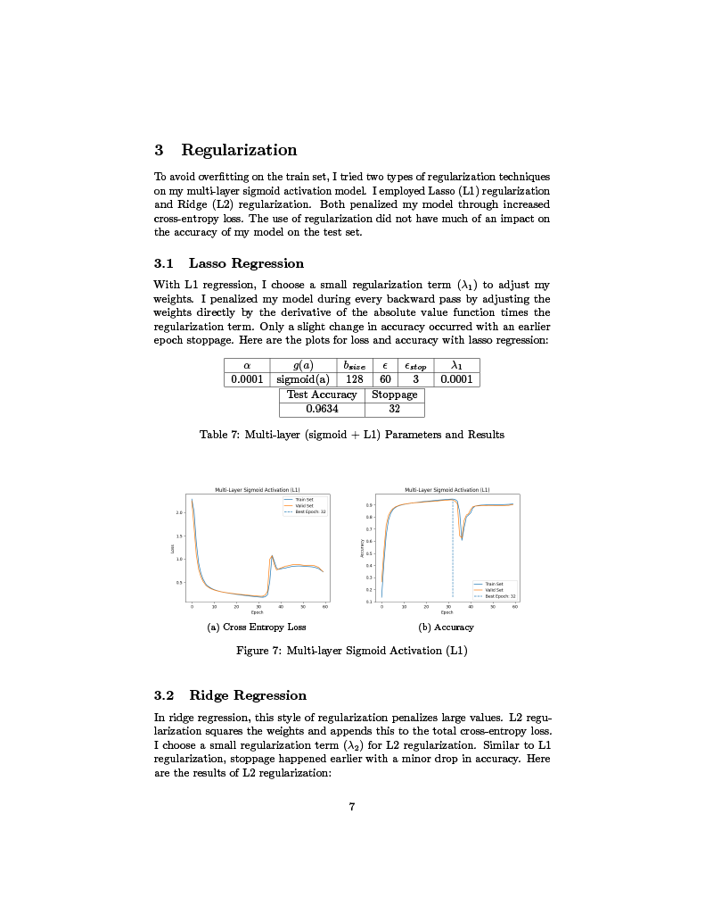
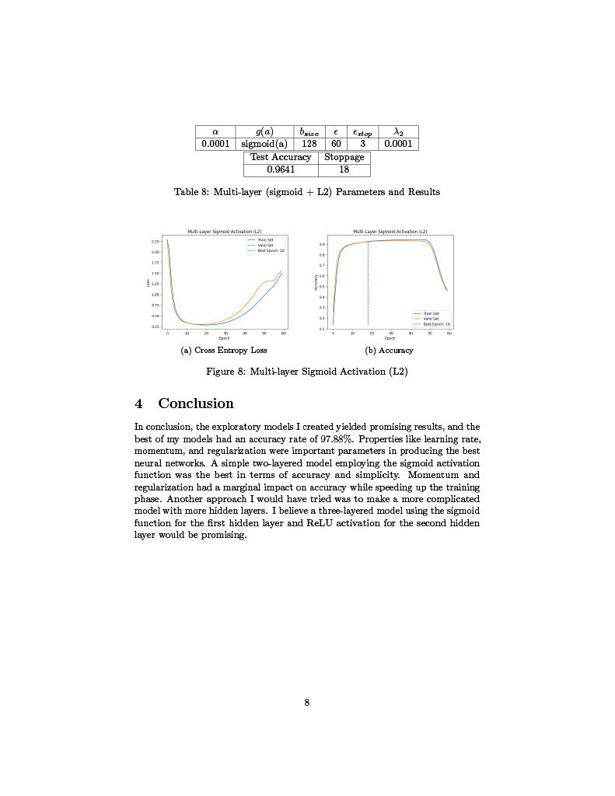

# MNIST Neural Network

Here are some basic neural network models to recognize images from the NMIST dataset.
No library implementations (Sklearn, Tensorflow, Keras, etc.) were used for my models.
Only NumPy and standard Python3 libraries were used.

# How To Run
Some of my models take a bit longer than others, but they all could be run through the `makefile`.

# My Mock NeurIPS Paper
[Link to pdf version](./paper/paper_pdf_version.pdf)

